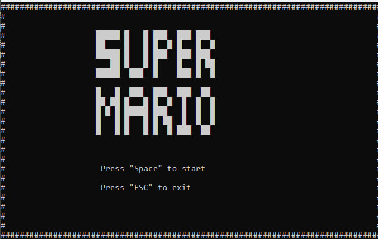
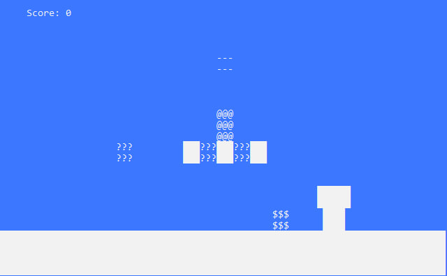
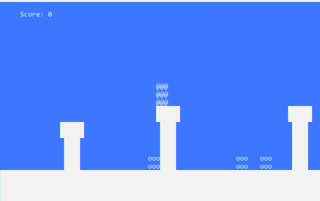
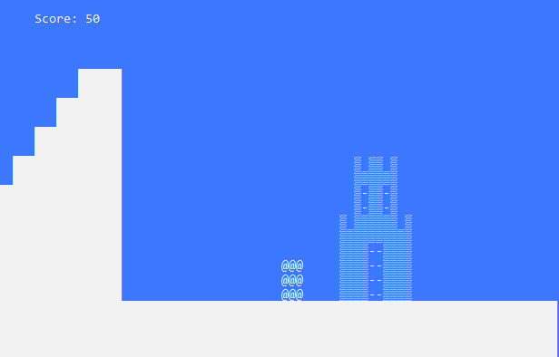

# VideoGames

## "Console platformer

### Общее описание
 "Console platformer" - это консольная версия Super Mario, вместо графики используются различные символы
 Игра сделана на основе видео с ютуб канала Begin End. Вот *ссылки на видео*:  
[Язык Си с нуля - Урок 29 - Пишем простую игру платформер](https://www.youtube.com/watch?v=7sTPrktLLBo&list=PLBOPkQsFLCR2DWRY74L03FmbRtz_Yy73_&index=30),  
[Язык Си с нуля - Урок 33 - Пишем игру платформер, добавляем врагов :-)](https://www.youtube.com/watch?v=8QDgZ3GNlt8&list=PLBOPkQsFLCR2DWRY74L03FmbRtz_Yy73_&index=34).

### Скриншоты игры
Скрины | Скрины
:--------------:|:--------------:
 |  
 | 

### Как играть
- Управление:  
'Space' - прыжок  
'A' - влево  
'D' - вправо  
'E' - поставить на паузу  
'Q' - продолжить игру
'Esc' - выйти из игры  

### Особенности игры
В игре присутсвует 3 уровня, разные по сложности. Ваша задача дойти с Марио до замка и прыгнуть на него для завершения уровня. В игре присутствуют враждебные мобы которые наносят вред Марио, их можно 
обойти или уничтожить, прыгнув на них сверху. За уничтожение моба дают 50 очков. Также Марио может собирать монетки, которые выпадают из блоков. Монетки дают 100 очков.

### Технические подробности
В заголовочном файле Map.h я сосредоточил все игровые функции